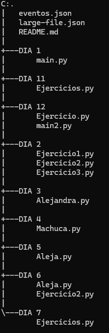

# PYTHON
Realización de trabajos en clase ordenados por días.

# Descripción
Este repositorio está dividido en varias carpetas nombradas con los días de trabajo asignados, dos archivos [.json] y un archivo README.

# Tecnologías utilizadas
- PYTHON
- JSON

# Estructura del proyecto

# Características

|Carpeta |Archivo | Descripción |
|--|--|--|
| DIA 1| main.py | El usuario ingresa dos números y se realiza la suma, resta, multiplicación y división entre dichos números.|
| DIA 2 | Ejercicio1.py | El usuario puede ingresar un número y el programa imprimirá la posición final y el valor en la serie de Fibonacci.|
||Ejercicio2.py| Este programa elige un número entre el 1 y el 100, el usuario ingresa varios números, en cada intento el usuario obtendrá una pista que lo ayudará hasta encontrar el número correcto|
||Ejercicio3.py|A diferencia del programa anterior, este también elige un número secreto y obtiene pistas, pero esta vez tendrá un limite de intentos para encontrar el número correcto.|
|DIA 3|Alejandra.py|Este programa muestra cuales son los números primos de los que el usuario ingresó, además muestra información sobre qué son los números primos|
|DIA 4|Machuca.py|El usuario ingresa una cantidad de dinero y el programa le devuelve la cantidad de monedas de 1, 5 y 10 que se necesita para cambiar la cantidad de dinero|
|DIA 5|Aleja.py|En este programa el usuario primero pondrá la cantidad de números que quiere ordenar y luego los ingresa uno por uno, una vez ya ingresados se imprimen de menor a mayor. |
|DIA 6|Aleja.py|Este programa es igual que el anterior, pero se diferencian en que este primero muestra los datos que ingresó el usuario y luego los muestra ordenados de menor a mayor pero sin números repetidos.|
||Ejercicio2.py|El usuario ingresa una lista y luego elige un número el cual el programa debe buscar y sumar de la lista ingresada, por último imprimirá el índice de los números que sumo.|
|DIA 7|Ejercicios.py|En este programa se creó un menú para facilitar la compra de los usuarios, en este podrá agregar los productos disponibles, ver qué productos eligió, cual es el precio final y por último cerrar el programa.|
|DIA 11|Ejercicios.py|El usuario da una serie de números y luego elige cual buscar, si el número que quiere buscar está entre los que ingresó el programa le mostrará el índice de este, y si el número no está el programa le mostrará en que índice iría el número.|
|DIA 12|Ejercicio.py|En este programa se creó un menú donde los usuarios pueden crear, actualizar, revisar y eliminar los eventos deseados.|
||main2.py|Este programa es una prueba del anterior.|

# Desarrollado por

El proyecto fue realizado por Alejandra Machuca, estudiante de CampusLands.